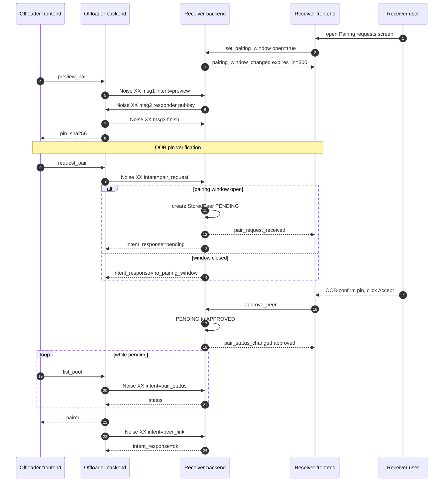

# Architecture

## Principles

1. **ESPHome is a CLI tool.** Firmware operations shell out to `esphome` via subprocess. Device metadata and serial ports use ESPHome Python imports. Board and component definitions come from our own `definitions/` directory.

2. **ESPHome is an optional dependency.** `pip install .[esphome]` pulls it in for standalone use. Plain `pip install .` works inside the ESPHome container.

3. **Frontend and backend are separate repos.** The frontend is a separate pip package. The backend try-imports it and serves the static files.

4. **WS-first API.** Everything goes through a single `/ws` WebSocket with command/response protocol. REST endpoints only for HA backward compat.

5. **Real-time events.** Clients subscribe once via `subscribe_events`, get instant push notifications. No polling needed.

6. **Persistent firmware jobs.** Compile/upload jobs are queued, run one at a time, survive page refreshes and server restarts.

7. **Device discovery.** mDNS browser for instant online/offline detection, ping sweep every 60s as fallback, optional MQTT discovery for devices that opt in via an `mqtt:` block. Source priority: `mdns > mqtt > ping`.

## Project Structure

```
esphome_device_builder/
├── device_builder.py          # Core singleton — owns controllers, event bus, web app
├── __main__.py                # CLI entry point
├── constants.py               # Version + defaults
│
├── models/                    # Data shapes only — no logic
│   ├── common.py              # EventType, ConfigEntry, PagedResponse
│   ├── devices.py             # Device, AdoptableDevice, DevicesResponse
│   ├── boards.py              # Board enums + models
│   ├── components.py          # Component enums + models
│   ├── firmware.py            # FirmwareJob, JobStatus, JobType
│   ├── preferences.py         # UserPreferences, Theme, DashboardView
│   └── api.py                 # WebSocket protocol models
│
├── controllers/               # Business logic — all state lives here
│   ├── boards.py              # BoardCatalog: 559 boards across 7 platforms
│   ├── components.py          # ComponentCatalog: 655 components
│   ├── devices.py             # DevicesController: CRUD, file scanning, logs
│   ├── firmware.py            # FirmwareController: job queue, compile, install
│   ├── automations.py         # AutomationsController: triggers + actions
│   └── config.py              # ConfigController + DashboardSettings + metadata
│
├── helpers/                   # Pure utilities
│   ├── api.py                 # @api_command decorator
│   ├── event_bus.py           # EventBus
│   ├── json.py                # JSON response, CORS
│   └── yaml.py                # YAML generation
│
├── api/                       # Transport layer
│   ├── ws.py                  # /ws WebSocket dispatch
│   └── legacy.py              # HA compat endpoints
│
└── definitions/               # Data files
    ├── boards/                # board YAML manifests
    ├── components.json        # components definitions (auto generated from schema.esphome.io)
    └── schemas/               # JSON schemas
```

## Controllers

| Controller | Responsibility |
|-----------|---------------|
| Devices | Device CRUD, file scanning, YAML validation, live logs |
| Firmware | Job queue, compile, install, upload, download binaries |
| Boards | Board catalog with search, filtering, pin maps |
| Components | Component catalog with search, config entries |
| Automations | Context-aware triggers + actions |
| Config | Version, serial ports, preferences, secrets |
| Onboarding | First-run setup state (welcome flow, default secrets, sample device) |
| RemoteBuild | mDNS browse + manual host entry + token store + first-use binding for the remote-build offload feature (issue #106) |
| Built-in | ping, subscribe_events |

## Event bus

In-process pub/sub, owned by `DeviceBuilder.bus` (an `EventBus` from `helpers/event_bus`). Controllers fire events on state transitions; WS commands subscribe via `subscribe_events` and stream them to connected clients. Event types are declared in `models/common.py` as `EventType(StrEnum)` members; the bus signature is `fire(event_type, data: Mapping[str, Any] | None)`.

### Typing event payloads

Mirrors Home Assistant core's `EventStateChangedData` / `EventStateReportedData` pattern: the wire shape stays a `dict`, but each event-specific shape is declared as a `TypedDict` next to the controller that fires it so type checkers validate the keys at the construction site.

Concretely, in `models/remote_build.py`:

```python
class RemoteBuildPairRequestReceivedData(TypedDict):
    dashboard_id: str
    pin_sha256: str
    label: str
    peer_ip: str
```

The call site builds the typed dict before firing:

```python
payload: RemoteBuildPairRequestReceivedData = {
    "dashboard_id": dashboard_id,
    "pin_sha256": pin_sha256,
    "label": label,
    "peer_ip": peer_ip,
}
self._db.bus.fire(EventType.REMOTE_BUILD_PAIR_REQUEST_RECEIVED, payload)
```

`EventBus.fire` (and `Event.data`) takes `Mapping[str, Any]` rather than `dict[str, Any]` so a `TypedDict` flows through without a `cast()` — `TypedDict` is structurally compatible with a read-only `Mapping`, and every consumer in the codebase reads via `event.data.get(...)` / `event.data["k"]` rather than mutating. Home Assistant goes one step further with a fully generic `Event[_DataT]` / `EventType[_DataT]` so subscribers also get a typed `event.data`; we don't need that depth, since no subscriber annotates `event.data` as a `TypedDict` today — they all just `.get()` the key they care about.

`TypedDict` rather than `@dataclass` because:

- The wire shape is a `dict`, not a class instance. `TypedDict` matches the runtime shape; `@dataclass` would need an `asdict()` step on every fire.
- Subscribers that ride the existing `subscribe_events` WS plumbing serialise the payload through `helpers.json.dumps` (orjson), which handles `dict` natively.
- It mirrors HA's convention so contributors moving between this codebase and HA find the same pattern.

Older event payloads (e.g. `REMOTE_BUILD_BINDING_MISMATCH`'s, fired with `asdict(BindingMismatch)`) predate this convention and get the typed treatment as they're touched. New events should ship with a TypedDict from day one.

## Firmware Job Queue

Jobs are persistent, event-driven, and decoupled from WebSocket connections:

```
firmware/install {configuration} → QUEUED → RUNNING → output... → COMPLETED/FAILED
                                     │                                    │
                                     └──── persisted to disk ─────────────┘
```

- One job runs at a time, others wait in queue
- Output buffered in `FirmwareJob.output` — survives disconnect
- `firmware/follow_job` sends history then streams live
- Error detection scans output for failure patterns (not just exit code)
- Jobs persist across server restarts

## Component Catalog

`definitions/components.json` is generated by `script/sync_components.py`
from ESPHome's pre-built schema bundle (https://schema.esphome.io). Schema +
narrow live `esphome` introspection cover most fields; `multi_conf`,
`platform_defaults`, `supported_platforms`, type refinement (boolean / float
recovery), and `unit_of_measurement` autocomplete options come from the live
package. Component-level descriptions and titles fall back to the docs MDX
(`esphome-docs` shallow clone) when the schema's index is sparse.

The same script runs nightly via
[`.github/workflows/sync-component-catalog.yml`](../.github/workflows/sync-component-catalog.yml)
— it pins the schema version to the dashboard's installed `esphome` to avoid
drift, runs `script/check_catalog.py` as a regression guard, and opens a
PR with a diff summary when the rebuild produces a change.

## CI / Release pipeline

- **`test.yml`** runs lint + the catalog smoke test on every PR, plus pytest
  across the supported Python matrix. Also callable as a preflight from
  `release.yml`.
- **`release.yml`** is the publish entrypoint — `workflow_dispatch` from
  the Actions tab or `workflow_call` from `auto-release.yml`. Inputs:
  - `version` — `X.Y.Z` for stable, `X.Y.ZbN` for beta.
  - `channel` — `release` or `prerelease`. Format must match (e.g.
    `release` rejects a `b`-suffix tag).

  The workflow stamps `pyproject.toml`, builds wheel + sdist, tags +
  creates the GitHub release with notes drafted from merged-PR labels
  (config in [.github/release-drafter.yml](../.github/release-drafter.yml)),
  attaches both artifacts, and publishes to PyPI. The GitHub release is
  an output of the workflow — don't publish one by hand.

  Tagging + release creation use the `ESPHOME_GITHUB_APP_*` org credentials
  so the workflow keeps working under branch protection. PyPI publish uses
  `PYPI_TOKEN` and is currently `continue-on-error: true` — drop that
  flag once a publish has succeeded.
- **`auto-release.yml`** runs nightly. If ≥ 2 commits have landed on
  `main` since the last release, computes the next prerelease version
  (`X.Y.ZbN` → `X.Y.Zb(N+1)`, or `X.Y.Z` → `X.Y.(Z+1)b1`) and calls
  `release.yml` with `channel=prerelease`. Stable releases are always
  manual.
- **`pr-labels.yaml`** enforces exactly-one-of the changelog labels.
- **`dependabot.yml`** keeps actions and pip dependencies fresh; `esphome`
  itself is pinned manually so the catalog smoke test stays a meaningful
  guard.

All workflow files are commented — start there for the source of truth.

## Authentication

Auth is opaque server-issued session tokens, gated by the WebSocket handshake. See [API.md](API.md#authentication) for the wire protocol.

When `--ha-addon` is set, the server binds **two** TCP sites on a shared `DeviceBuilder` singleton:

- **Public site** (`--host:--port`, default `0.0.0.0:6052`) — the standard dashboard. The auth middleware enforces password (or bearer token) on REST endpoints, and the WS handler enforces the in-band `auth` handshake. This is what users hit at `http://homeassistant.local:6052`.
- **Trusted ingress site** (`--ingress-host:--ingress-port`, default `0.0.0.0:8099` inside the addon container) — bound to the supervisor's docker network only, never exposed externally. Skips the auth gate because the supervisor has already authenticated the request upstream. The HA add-on `config.yaml` advertises `ingress_port` to the supervisor so the ingress proxy knows where to forward.

This is the Music Assistant pattern: physically separating the listeners is the security boundary, rather than trusting an `X-Ingress-Path` header. It also means HA app users can keep ingress access (no password) while operators can still secure direct access from outside HA with a username/password.

The legacy `DISABLE_HA_AUTHENTICATION=true` env var skips the ingress site entirely — operators get only the password-gated public port.

### Reverse-proxy / cross-origin deployments

When the dashboard is exposed behind a reverse proxy (nginx, Caddy, Traefik, nginx-proxy-manager, …) under a hostname that doesn't match the upstream bind address, the WS handshake's strict `Origin === Host` check rejects the connection. Operators set `--trusted-domains` (or `$ESPHOME_TRUSTED_DOMAINS`, the legacy ESPHome dashboard env var name) to a comma-separated allowlist of hostnames they want the dashboard to accept:

```bash
# CLI
esphome-device-builder /config --username dash --password ... \
  --trusted-domains dashboard.example.com,proxy.example.com

# Env var (matches the legacy ESPHome dashboard's name)
ESPHOME_TRUSTED_DOMAINS=dashboard.example.com esphome-device-builder /config ...
```

The allowlist drives two checks in the WS handshake (both opt-in; empty = strict legacy behaviour):

- **Origin allowlist** — accepts cross-origin connections whose `Origin` header's hostname is in the list. Required for any reverse-proxy deployment where the proxy hostname differs from the upstream Host.
- **Host allowlist** — rejects any connection whose `Host` header isn't in the list. Defense in depth against DNS rebinding (an attacker domain that resolves to the victim's LAN IP would carry an unfamiliar Host).

Both gates apply only to requests that carry an `Origin` header. Browsers always set `Origin` for the WebSocket opening handshake, so DNS-rebinding attempts land inside the gate; non-browser clients (CLI tools, the HA integration, direct `websockets` clients) omit `Origin` and skip both gates. The bearer-token / in-band auth path is doing the work for those clients, and gating on `Origin` means an operator hardening against rebinding doesn't accidentally lock out their HA integration.

Match is case-insensitive and port-tolerant: `dashboard.example.com` accepts `Dashboard.Example.com:8443`. IPv6 may be entered with or without brackets (`::1` and `[::1]` both work). Use `*` as the only entry to opt out of the Host restriction while still permitting cross-origin handshakes (handy when the Host varies per request).

## Discovery (mDNS)

Two mDNS surfaces ride the same `AsyncEsphomeZeroconf` instance the device state monitor already owns. Sharing one Zeroconf singleton matters: opening a second responder fights for the same multicast socket and silently drops half the packets.

**Devices** (`_esphomelib._tcp.local.`) — passive browse. ESPHome devices broadcast on this service type; `DeviceStateMonitor`'s browser callback turns `Added` / `Updated` / `Removed` events into ONLINE / OFFLINE state transitions and TXT-driven config-hash / version / api-encryption updates. See "Two mDNS paths with different OFFLINE semantics" in [CLAUDE.md](../CLAUDE.md) for the asymmetric trust rules between the browser callback and the one-off active-resolve path.

**Dashboards** (`_esphomebuilder._tcp.local.`) — bidirectional. The dashboard advertises its own service instance on startup (skipped in HA-addon mode by default; the addon container's docker IP isn't LAN-routable). TXT carries `server_version` + `esphome_version` always; `pin_sha256` + `remote_build_port` are added when the remote-build receiver site is bound. Browse runs in `RemoteBuildController`, populates `remote_build/list_hosts`, and merges with manually-added `(hostname, port)` rows from `_remote_build.manual_hosts`.

The 15-character RFC 6335 §5.1 cap on service-type labels is why the new type is `_esphomebuilder` (14 chars) rather than `_esphomedashboard` (16, would be truncated). Keeps the `_esphome*` prefix consistent with the existing device service type.

## Remote build

Receiver-side surface for the remote-build offload feature (issue #106). The dashboard can play *receiver* (lend its CPU to other dashboards) and *offloader* (delegate compiles to a paired receiver). Phases 3a–3c landed the receiver half against a bearer-token auth model that is now being torn out and replaced by the Noise XX peer-link described below; phase 4a-r1 is in flight. Bullets further down ("Second TCP listener", "Middleware stack", "Token store", "First-use binding") describe the currently-shipped bearer machinery that phase 4a-r2 deletes wholesale.

### Pairing auth flow (Noise XX, phase 4 target)

Pairing is a two-side flow, but in the typical case both sides are operated by the same user with two dashboards open in different tabs (HA add-on + ESPHome Desktop, two HA instances they own, etc.). The trust model already concentrates authority on each side: anyone with shell-level access to either dashboard's `<config_dir>` can read or rotate the X25519 peer-link keypair, mint pair_requests, or accept them, so distributing pair-time authority across multiple humans only makes sense when they're already shell co-administrators of the same deployment. The flow is: open the receiver's Pairing requests screen in one tab, click Pair on the offloader in another, OOB-confirm the pin matches both UIs, click Accept back on the receiver. The two-operator case (a shared deployment) is supported and uses the same protocol; it just means switching tabs becomes "ask my colleague to look at theirs."

Out-of-band pin verification defeats a LAN MITM at first contact (the only window where pinning hasn't established trust yet); the **pairing window** narrows when new requests are even accepted (only while the Pairing requests screen on the receiving dashboard is mounted) so an idle receiver doesn't accumulate inbox noise from arbitrary LAN scanners. Already-approved peers connect anytime for real builds; the window only gates new pair_requests.

The cryptographic primitives are `Noise_XX_25519_ChaChaPoly_SHA256` (mutual identity exchange + forward secrecy) over a dedicated peer-link TCP listener (default port 6055, separate from the dashboard UI port; configurable via `--remote-build-port`). Phases 3b1-3c shipped the same port as an HTTPS+bearer site; phase 4a-r1 part 4 swapped the body to plain-TCP serving the Noise WS. Each dashboard holds a long-lived X25519 keypair as its peer-link identity, persisted at `<config_dir>/.device-builder-peer-link-key.bin` (0o600); `pin_sha256` is the lowercase-hex SHA-256 of the static pubkey.

The numbered phases:

All WS commands below use the `remote_build/` namespace and all events use the `remote_build_` prefix (matching the existing convention in `docs/API.md` and `models/common.py`); the diagram further down strips both for readability.

1. **Discovery** — both dashboards advertise on mDNS (`_esphomebuilder._tcp.local`); TXT carries `remote_build_port` + `pin_sha256`. The TXT keys themselves don't change across the bearer→Noise pivot; the `pin_sha256` value semantic does (was the Ed25519 cert SPKI hash, becomes the X25519 pubkey hash after phase 4a-r1 part 4 swaps the listener body).
2. **Receiver opens pairing window** — the user opens Settings → Build server → Pairing requests on the receiving dashboard; the frontend calls `remote_build/set_pairing_window` with `open=true`; the backend flips an in-process deadline and fires `remote_build_pairing_window_changed`. The window closes automatically on screen-unmount or user-idle timeout.
3. **Preview pair (intent=preview)** — three Noise XX handshake messages. The offloader captures the receiver's static pubkey from the handshake transcript and surfaces `pin_sha256` to the user; no application data crosses the wire.
4. **OOB pin verification** — human-mediated. The user compares the pin shown on the offloader UI against the receiver UI's Build server card.
5. **Pair request (intent=pair_request)** — fresh Noise XX with payload `{label, dashboard_id}`. If the pairing window is open, the receiver creates a PENDING `StoredPeer` row, fires `remote_build_pair_request_received`, and returns `intent_response=pending`. If the window is closed, it returns `intent_response=no_pairing_window` without creating a row.
6. **Receiver-side approve** — user OOB-confirms the offloader's pin, clicks Accept on the receiving dashboard; `remote_build/approve_peer` flips the row to APPROVED and fires `remote_build_pair_status_changed`.
7. **Offloader observes approval (5s polling)** — while the offloader's local row is pending, its frontend polls `remote_build/list_pool`; the offloader backend opens a fresh Noise WS with `intent=pair_status` and writes the response back into the local row.
8. **Subsequent real-build sessions** — `intent=peer_link`. **Not gated by the pairing window**; paired peers connect anytime. The receiver looks up the offloader's static-pubkey-hash against its `StoredPeer` table; an APPROVED match returns `intent_response=ok` and the session stays open for application messages.



**Why two Noise handshakes for one pairing.** The preview handshake (step 3) captures the receiver's static pubkey for OOB display *before* the offloader has decided to trust this receiver; the WS closes immediately, no application data crosses the wire. The pair-request handshake (step 5) is a fresh handshake that re-binds the OOB-confirmed pin (defends against TOCTOU between preview and confirm: if the pubkey-hash on the second handshake doesn't match `pin_sha256` from preview, the offloader aborts). Re-handshakes are cheap because Noise's setup cost is negligible at this cadence (pair flows are rare, not a hot path).

**Why polling instead of a long-held WS.** The offloader's `request_pair` returns immediately with `pending`; the offloader's frontend polls `list_pool` every 5s while a pending row is visible. The alternative (a long-held WS frame waiting for the user to click Accept on the receiving dashboard) fails on idle timeouts (load-balancer, HA add-on ingress, offloader process restart) and forces the receiver to track stale connections across approval. Polling makes each interaction self-contained; a 2s server-side debounce on the offloader backend caches the receiver-side status to prevent cross-tab amplification.

**Identity rotation.** The peer-link X25519 keypair has its own rotation lifecycle (`rotate_peer_link_identity`), independent of the phase-3a Ed25519 cert. Rotating the 3a cert does NOT change the X25519 pubkey; only `rotate_peer_link_identity` does. When the user rotates, the `dashboard_id` stays stable but `pin_sha256` changes; every paired peer sees a `pin_mismatch` event on the next handshake and has to re-pair (this is the desired behaviour for "operator suspects compromise"). The separate-keypair design was decided during PR #472 review: the alternative (deriving X25519 from Ed25519 via libsodium-style `crypto_sign_ed25519_sk_to_curve25519`) adds non-trivial code for no benefit pre-release, and an implicit cascade would hide a security-relevant rotation event behind a routine cert renewal.

### Currently-shipped bearer machinery (slated for deletion in 4a-r2)

**Second TCP listener.** When `_remote_build.enabled` is `true`, `DeviceBuilder` binds a third aiohttp `TCPSite` on `--remote-build-port` (default 6055) over TLS, served with the cert from `helpers/dashboard_identity`. Disabled by default; the listener doesn't bind at all when the toggle is off (a sidecar `enabled=false` skip beats default-deny 404s — nothing to probe). This sits alongside the public + ingress sites from the Authentication section: HA-addon mode with remote-build enabled binds three listeners on three different ports, each with its own middleware stack.

**Middleware stack** (`/remote-build/v1/*` only, outer → inner):
- `_strip_server_header_middleware` — overrides aiohttp's `Server: Python/x.y aiohttp/z.w` banner to empty string. (Setting to empty wins; `del response.headers["Server"]` doesn't catch the connection-level injection.)
- `make_remote_build_auth_middleware` — bearer parse (RFC-7235 case-insensitive scheme + RFC-7230 BWS tolerant), `hmac.compare_digest` against the stored hash, per-IP `RateLimiter` (10 fails / 60s window / 5min lockout, 429 with `Retry-After`), `X-Dashboard-ID` first-use binding (400 missing / 403 mismatch / event-fire on the 403 path).

**Identity** (`helpers/dashboard_identity`). On first dashboard start, generates an Ed25519 self-signed cert (100-year validity, SAN=localhost, EKU=SERVER_AUTH critical), persists `(.device-builder-cert.pem, .device-builder-key.pem)` next to the metadata sidecar, and a stable random `dashboard_id` under `_remote_build.dashboard_id`. The cert/key files are sync I/O via `helpers/atomic_io.atomic_write`; module-level `_IDENTITY_LOCK` serialises first-time creation. Trust model is **SPKI-pinning, not cert-pinning** — the pin field is `pin_sha256`, the SHA-256 over the SubjectPublicKeyInfo (lowercase hex). Rotation is explicit and always rotates the keypair: `rotate_certificate(config_dir)` mints a fresh cert + key, so the SPKI changes and `pin_sha256` changes; every paired offloader sees a fingerprint mismatch on the next connection and has to re-verify (this is the desired behaviour for "operator suspects compromise"; phase 4's pair UX surfaces the re-verify step). `dashboard_id` is preserved across rotations so the receiver-side audit trail stays readable. Phase 3c1 added `remote_build/get_identity` / `remote_build/rotate_identity` WS commands so the Settings UI can render and trigger rotation; when the listener is bound, the rotate command tears it down (TXT drops both `pin_sha256` and `remote_build_port` immediately so peers re-browsing don't see a stale pin pointing at a port that's no longer serving), rebuilds against the new cert, and re-pushes both TXT properties on success. When the listener isn't bound, rotation only writes the new cert + key to disk; mDNS isn't updated because there's no listener for peers to connect to. The TXT contract — `pin_sha256` + `remote_build_port` appear together iff the listener is currently bound — holds across rotation.

**Token store.** Receiver-side bearers persist as `StoredToken` rows under `_remote_build.tokens[]` carrying `{token_id, label, secret_sha256, created_at, bound_dashboard_id}`. Wire shape is `TokenSummary` (drops `secret_sha256`). The cleartext bearer is generated **client-side** in the frontend (`crypto.getRandomValues` only — a fallback to `Math.random` would be a security regression because the backend can verify only the hash's shape, not its entropy): `token_id` is the textual form of 8 random bytes after base64url encoding (exactly 11 chars; backend pins the length so the 64-bit collision math at the 100-token cap stays load-bearing) and `secret` is 32 random bytes after base64url encoding (43 chars). The frontend computes `SHA-256(secret)` locally and POSTs only `{label, token_id, secret_sha256}`; the cleartext stays on the user's screen long enough to copy into the offloader and is then discarded. This closes the leak that a server-side `create_token` would have on plain-HTTP standalone deployments where the main port carries the WS API in cleartext.

**First-use binding.** Every authenticated `/remote-build/v1/*` request must carry an `X-Dashboard-ID` header (base64url, ≤ 64 chars). On the first authenticated request for a token whose `bound_dashboard_id` is `null`, the middleware persists the value via `RemoteBuildController.bind_token_first_use(token_id, dashboard_id)` under the metadata-transaction lock. Subsequent mismatches return **403** (NOT 401: the token IS valid, the peer is wrong) and fire a typed `remote_build_binding_mismatch` event carrying `BindingMismatch(token_id, presented_dashboard_id, bound_dashboard_id, peer_ip, race_loss)`. `race_loss=true` flags concurrent first-use bind races (operator paste-into-two-offloaders, soften UI wording); `race_loss=false` is the loud already-bound mismatch (stolen bearer or paste-into-wrong-machine). The 403 path is intentionally NOT rate-limited — that's the alert channel; rate-limiting it would mask the alert under the same threshold as routine bad bearers. The 400-on-malformed-header path IS rate-limited (a 400 confirms the bearer was valid; without rate-limiting, a peer with a stolen bearer could probe the binding shape unlimited times).

## Persisted state and security expectations

The dashboard writes a small set of files into `<config_dir>` and treats them as durable per-installation state. A few have non-obvious security expectations.

| File | Sensitivity | Mode |
|---|---|---|
| `.device-builder.json` | Mostly identifier-only (`dashboard_id`, `_remote_build.enabled`, `manual_hosts`). The `_remote_build.tokens[]` rows carry `secret_sha256` for issued bearers — hashes, not cleartext. A leaked snapshot doesn't surrender working bearers (256-bit secret + SHA-256 makes offline brute-force infeasible) but does reveal which `dashboard_id`s have paired. | umask default |
| `.device-builder-cert.pem` | Public TLS cert. Not sensitive. | mkstemp default (0o600) |
| `.device-builder-key.pem` | **Private TLS key. Sensitive.** A reader of this file can impersonate the dashboard to any paired peer. | 0o600 enforced at write time |

**Backup tools must preserve `0o600` on `.device-builder-key.pem`.** The dashboard writes the file at the right mode via `tempfile.mkstemp` + `os.replace`, but a tar-then-restore-as-different-user round-trip can land it at the umask default. Operators backing up `<config_dir>` should use a tool that captures and restores POSIX modes (e.g. `tar --preserve-permissions`, `rsync -p`, `restic`). The dashboard does *not* re-tighten the mode on every load (the load-time chmod was deliberately removed as untested defensive code) — once relaxed it stays relaxed until the next `rotate_certificate` call.

**The dashboard expects — and enforces — exactly one process per `<config_dir>`.** Identity files, the metadata sidecar, and the build tree are all guarded by per-process `threading.Lock`s; two `device-builder` processes running against the same config directory would race on writes. Startup takes an exclusive `fcntl.flock` on `<config_dir>/.device-builder.lock` (see `helpers/single_instance.ensure_single_execution`); a second start refuses with the running PID + start time on stderr. The OS releases the lock on process exit, so a stale lock file with no holder is harmless and re-acquired cleanly. Windows lacks `fcntl` and the check is a silent no-op there; the HA-addon shape (the dominant production target) is POSIX-only, and dev / Desktop on Windows accept the residual race risk in exchange for not needing `msvcrt.locking` plumbing. If a multi-process model is ever needed, the per-process `threading.Lock`s would also need to become cross-process file-locks.

**`dashboard_id` is an identifier, not a secret.** It's shared with paired peers as part of pairing handshakes (sent in the `X-Dashboard-ID` request header on every authenticated `/remote-build/v1/*` request). A leaked metadata sidecar reveals the ID but doesn't, on its own, grant access. Phase 3b3's first-use binding pairs each issued bearer against the offloader's `dashboard_id` on first use, so the ID becomes part of the auth context at that point — leakage of an issued bearer *together with* the dashboard's ID would defeat the binding check; bearer secrets themselves remain the load-bearing secret. The `dashboard_id` is **not** published in mDNS TXT — only `pin_sha256` + `remote_build_port` are advertised; the peer learns each other's IDs as part of pairing.

## Deployment

### Beta (HA add-on)

Toggle `new_dashboard_beta` in the ESPHome add-on. Pip-installs the device builder and runs it.

### Production

Baked into the ESPHome container. Legacy dashboard deprecated.

## Legacy HA Compatibility

`api/legacy.py` serves: `GET /devices`, `GET /json-config`, `/compile`, `/upload` (spawn protocol).
