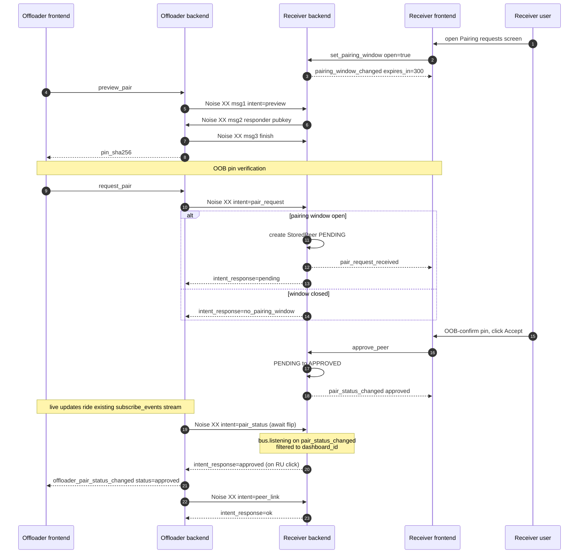

# Architecture

## Principles

1. **ESPHome is a CLI tool.** Firmware operations shell out to `esphome` via subprocess. Device metadata and serial ports use ESPHome Python imports. Board and component definitions come from our own `definitions/` directory.

2. **ESPHome is an optional dependency.** `pip install .[esphome]` pulls it in for standalone use. Plain `pip install .` works inside the ESPHome container.

3. **Frontend and backend are separate repos.** The frontend is a separate pip package. The backend try-imports it and serves the static files.

4. **WS-first API.** Everything goes through a single `/ws` WebSocket with command/response protocol. REST endpoints only for HA backward compat.

5. **Real-time events.** Clients subscribe once via `subscribe_events`, get instant push notifications. No polling needed.

6. **Persistent firmware jobs.** Compile/upload jobs are queued, run one at a time, survive page refreshes and server restarts.

7. **Device discovery.** mDNS browser for instant online/offline detection, ping sweep every 60s as fallback, optional MQTT discovery for devices that opt in via an `mqtt:` block. Source priority: `mdns > mqtt > ping`.

## Project Structure

```
esphome_device_builder/
├── device_builder.py          # Core singleton — owns controllers, event bus, web app
├── __main__.py                # CLI entry point
├── constants.py               # Version + defaults
│
├── models/                    # Data shapes only — no logic
│   ├── common.py              # EventType, ConfigEntry, PagedResponse
│   ├── devices.py             # Device, AdoptableDevice, DevicesResponse
│   ├── boards.py              # Board enums + models
│   ├── components.py          # Component enums + models
│   ├── firmware.py            # FirmwareJob, JobStatus, JobType
│   ├── preferences.py         # UserPreferences, Theme, DashboardView
│   └── api.py                 # WebSocket protocol models
│
├── controllers/               # Business logic — all state lives here
│   ├── boards.py              # BoardCatalog: 559 boards across 7 platforms
│   ├── components.py          # ComponentCatalog: 655 components
│   ├── devices.py             # DevicesController: CRUD, file scanning, logs
│   ├── firmware.py            # FirmwareController: job queue, compile, install
│   ├── automations.py         # AutomationsController: triggers + actions
│   └── config.py              # ConfigController + DashboardSettings + metadata
│
├── helpers/                   # Pure utilities
│   ├── api.py                 # @api_command decorator
│   ├── event_bus.py           # EventBus
│   ├── json.py                # JSON response, CORS
│   └── yaml.py                # YAML generation
│
├── api/                       # Transport layer
│   ├── ws.py                  # /ws WebSocket dispatch
│   └── legacy.py              # HA compat endpoints
│
└── definitions/               # Data files
    ├── boards/                # board YAML manifests
    ├── components.json        # components definitions (auto generated from schema.esphome.io)
    └── schemas/               # JSON schemas
```

## Controllers

| Controller | Responsibility |
|-----------|---------------|
| Devices | Device CRUD, file scanning, YAML validation, live logs |
| Firmware | Job queue, compile, install, upload, download binaries |
| Boards | Board catalog with search, filtering, pin maps |
| Components | Component catalog with search, config entries |
| Automations | Context-aware triggers + actions |
| Config | Version, serial ports, preferences, secrets |
| Onboarding | First-run setup state (welcome flow, default secrets, sample device) |
| RemoteBuild | mDNS browse + Noise XX peer-link pair / unpair / pair-status flows for the remote-build offload feature (issue #106) |
| Built-in | ping, subscribe_events |

## Event bus

In-process pub/sub, owned by `DeviceBuilder.bus` (an `EventBus` from `helpers/event_bus`). Controllers fire events on state transitions; WS commands subscribe via `subscribe_events` and stream them to connected clients. Event types are declared in `models/common.py` as `EventType(StrEnum)` members.

### Typing event payloads

`Event` and `EventBus.fire` are generic on the data shape so each event flows through with its TypedDict intact:

```python
@dataclass
class Event[DataT]:
    event_type: EventType
    data: DataT


class EventBus:
    def fire[DataT](self, event_type: EventType, data: DataT) -> None: ...
    def add_listener(
        self,
        event_type: EventType,
        listener: Callable[[Event[Any]], None],
    ) -> Callable[[], None]: ...
```

Each event-specific shape is declared as a `TypedDict` next to the controller that fires it. In `models/remote_build.py`:

```python
class RemoteBuildPairRequestReceivedData(TypedDict):
    dashboard_id: str
    pin_sha256: str
    label: str
    peer_ip: str
```

The fire site uses the TypedDict-call syntax so mypy validates the construction:

```python
self._db.bus.fire(
    EventType.REMOTE_BUILD_PAIR_REQUEST_RECEIVED,
    RemoteBuildPairRequestReceivedData(
        dashboard_id=dashboard_id,
        pin_sha256=pin_sha256,
        label=label,
        peer_ip=peer_ip,
    ),
)
```

The subscriber narrows by typing its callback's `event` parameter:

```python
def _on_pair_status(event: Event[RemoteBuildPairStatusChangedData]) -> None:
    status = event.data["status"]  # mypy: Literal['approved'] | Literal['removed']

bus.add_listener(EventType.REMOTE_BUILD_PAIR_STATUS_CHANGED, _on_pair_status)
```

`add_listener` is *not* generic on `_DataT` — listeners share a bucket type-erased as `Callable[[Event[Any]], None]` and `Any`'s bidirectional compatibility lets a `Callable[[Event[XData]], None]` register cleanly. The alternative — per-event-type overloads keyed on `Literal[EventType.X]` — was rejected: at end-state it would mean ~42 overloads (21 events × `fire`+`add_listener`), past mypy's practical resolution-perf limits. The trade: the type system enforces the *correct* pairing (subscriber typed for the matching event) but doesn't reject the *wrong* pairing (subscriber typed for a different event). Mismatches live in code review.

Mirrors HA core's `Event[_DataT]` / `EventType[_DataT]` pattern. Deliberate divergence: HA bounds `_DataT` to `Mapping[str, Any]` with that as the default so untyped events fall through; we drop the bound entirely. Untyped fire sites pass plain `dict[str, Any]` and mypy infers `DataT` from the call.

`TypedDict` rather than `@dataclass` because:

- The wire shape is a `dict`, not a class instance. `TypedDict` matches the runtime shape; `@dataclass` would need an `asdict()` step on every fire.
- Subscribers that ride the existing `subscribe_events` WS plumbing serialise the payload through `helpers.json.dumps` (orjson), which handles `dict` natively.
- It mirrors HA's convention so contributors moving between this codebase and HA find the same pattern.

`tests/test_event_payload_contracts.py` pins each TypedDict against its emitter at runtime — for every payload class, a factory invokes the production code path (TypedDict-call constructor or a helper that returns the dict literal as a TypedDict alias) and asserts the resulting dict's keys equal the TypedDict's `__annotations__`. A second test walks `models.*` and asserts every `*Data(TypedDict)` discoverable in the namespace is listed in the factory table — so a future PR adding a TypedDict can't silently skip the contract check.

New events should ship with a TypedDict from day one.

### Stateful lists ride `subscribe_events`, not `list_*` WS commands

Any per-session list whose contents mutate over the lifetime of a connected client (devices, importable devices, offloader pairings, receiver peers, …) reaches the frontend through one shape:

1. **RAM-canonical state on the controller.** A keyed dict (`controller._approved_peers: dict[str, StoredPeer]`, `_pairings: dict[tuple[str, int], StoredPairing]`, etc.) is the runtime source of truth. Mutations update the dict immediately and schedule a debounced disk write through a per-file `helpers.storage.Store` (`.receiver_peers.json`, `.offloader_pairings.json`). Reads — projections, post-mutation responses, dispatch lookups — read straight off the dict; no executor hop, no disk read, no read-vs-write race window. RAM seeds from the Store at `controller.start()`; disk is just persistence.

2. **First paint via `subscribe_events` `initial_state`.** A sync `*_snapshot()` method on the controller (`pairings_snapshot()`, `peers_snapshot()`) returns the projection. The seed point is the `_send_initial` inner async helper inside `DeviceBuilder._cmd_subscribe_events`, passed as the `send_initial=` callback to `helpers.event_bus.stream_events`; it stitches the snapshot into `initial["<key>"] = [s.to_dict() for s in controller.<key>_snapshot()]`. Snapshot reads must be sync — the subscribe handler runs in the WS dispatch hot path.

3. **Live updates via per-mutation TypedDict events.** Every state transition fires one event whose payload carries every field a subscriber needs to construct the row from the event alone. If the snapshot would carry a timestamp / pin / label, the event payload carries the same value (e.g. `RemoteBuildPairRequestReceivedData.paired_at`). The frontend mutates its local list directly from events; there is no follow-up "refetch" command.

4. **Listener-attach-then-snapshot ordering is load-bearing.** `stream_events` attaches the bus listener *before* awaiting the `send_initial` callback, so any event fired during the snapshot await is buffered behind the `initial_state` and delivered in order. Subscribers can rely on "initial state first, then live updates" without reordering logic.

The shape *not* to use on new code: `list_X` WS command read once on mount, re-fetched after every mutation. Three failure modes, all of which we've hit:

- **Read-vs-write races.** A snapshot read concurrent with a write returns whichever side won the lock, which may disagree with what the next event delivers a moment later; the frontend's local state ping-pongs until the user reloads. Receiver-side `remote_build/list_peers` had this exact shape before #514 — `load_remote_build_settings` on every read raced `_modify_settings` writes against the metadata sidecar.
- **Cross-tab desync.** A second tab mutating state never reaches the first tab unless the first tab re-polls; subscribers on the same dashboard see different worlds.
- **Round-trip overhead.** Every mutation pays a follow-up list-fetch the events were already going to deliver. On a cold tab the first paint is gated on the round-trip.

Carve-outs that are *not* state-surfaces and stay RPC: `devices/list_archived` (cold archive directory listing, dedicated screen, read-once). `labels/list` is the middle-ground holdover — snapshot-fetch-then-events rather than full subscribe-driven; new code should land through `initial_state` rather than copy that shape.

## Firmware Job Queue

Jobs are persistent, event-driven, and decoupled from WebSocket connections:

```
firmware/install {configuration} → QUEUED → RUNNING → output... → COMPLETED/FAILED
                                     │                                    │
                                     └──── persisted to disk ─────────────┘
```

- One job runs at a time, others wait in queue
- Output buffered in `FirmwareJob.output` — survives disconnect
- `firmware/follow_job` sends history then streams live
- Error detection scans output for failure patterns (not just exit code)
- Jobs persist across server restarts

## Component Catalog

`definitions/components.json` is generated by `script/sync_components.py`
from ESPHome's pre-built schema bundle (https://schema.esphome.io). Schema +
narrow live `esphome` introspection cover most fields; `multi_conf`,
`platform_defaults`, `supported_platforms`, type refinement (boolean / float
recovery), and `unit_of_measurement` autocomplete options come from the live
package. Component-level descriptions and titles fall back to the docs MDX
(`esphome-docs` shallow clone) when the schema's index is sparse.

The same script runs nightly via
[`.github/workflows/sync-component-catalog.yml`](../.github/workflows/sync-component-catalog.yml)
— it pins the schema version to the dashboard's installed `esphome` to avoid
drift, runs `script/check_catalog.py` as a regression guard, and opens a
PR with a diff summary when the rebuild produces a change.

## CI / Release pipeline

- **`test.yml`** runs lint + the catalog smoke test on every PR, plus pytest
  across the supported Python matrix. Also callable as a preflight from
  `release.yml`.
- **`release.yml`** is the publish entrypoint — `workflow_dispatch` from
  the Actions tab or `workflow_call` from `auto-release.yml`. Inputs:
  - `version` — `X.Y.Z` for stable, `X.Y.ZbN` for beta.
  - `channel` — `release` or `prerelease`. Format must match (e.g.
    `release` rejects a `b`-suffix tag).

  The workflow stamps `pyproject.toml`, builds wheel + sdist, tags +
  creates the GitHub release with notes drafted from merged-PR labels
  (config in [.github/release-drafter.yml](../.github/release-drafter.yml)),
  attaches both artifacts, and publishes to PyPI. The GitHub release is
  an output of the workflow — don't publish one by hand.

  Tagging + release creation use the `ESPHOME_GITHUB_APP_*` org credentials
  so the workflow keeps working under branch protection. PyPI publish uses
  `PYPI_TOKEN` and is currently `continue-on-error: true` — drop that
  flag once a publish has succeeded.
- **`auto-release.yml`** runs nightly. If ≥ 2 commits have landed on
  `main` since the last release, computes the next prerelease version
  (`X.Y.ZbN` → `X.Y.Zb(N+1)`, or `X.Y.Z` → `X.Y.(Z+1)b1`) and calls
  `release.yml` with `channel=prerelease`. Stable releases are always
  manual.
- **`pr-labels.yaml`** enforces exactly-one-of the changelog labels.
- **`dependabot.yml`** keeps actions and pip dependencies fresh; `esphome`
  itself is pinned manually so the catalog smoke test stays a meaningful
  guard.

All workflow files are commented — start there for the source of truth.

## Authentication

Auth is opaque server-issued session tokens, gated by the WebSocket handshake. See [API.md](API.md#authentication) for the wire protocol.

When `--ha-addon` is set, the server binds **two** TCP sites on a shared `DeviceBuilder` singleton:

- **Public site** (`--host:--port`, default `0.0.0.0:6052`) — the standard dashboard. The auth middleware enforces password on REST endpoints, and the WS handler enforces the in-band `auth` handshake. This is what users hit at `http://homeassistant.local:6052`.
- **Trusted ingress site** (`--ingress-host:--ingress-port`, default `0.0.0.0:8099` inside the addon container) — bound to the supervisor's docker network only, never exposed externally. Skips the auth gate because the supervisor has already authenticated the request upstream. The HA add-on `config.yaml` advertises `ingress_port` to the supervisor so the ingress proxy knows where to forward.

This is the Music Assistant pattern: physically separating the listeners is the security boundary, rather than trusting an `X-Ingress-Path` header. It also means HA app users can keep ingress access (no password) while operators can still secure direct access from outside HA with a username/password.

The legacy `DISABLE_HA_AUTHENTICATION=true` env var skips the ingress site entirely — operators get only the password-gated public port.

### Reverse-proxy / cross-origin deployments

When the dashboard is exposed behind a reverse proxy (nginx, Caddy, Traefik, nginx-proxy-manager, …) under a hostname that doesn't match the upstream bind address, the WS handshake's strict `Origin === Host` check rejects the connection. Operators set `--trusted-domains` (or `$ESPHOME_TRUSTED_DOMAINS`, the legacy ESPHome dashboard env var name) to a comma-separated allowlist of hostnames they want the dashboard to accept:

```bash
# CLI
esphome-device-builder /config --username dash --password ... \
  --trusted-domains dashboard.example.com,proxy.example.com

# Env var (matches the legacy ESPHome dashboard's name)
ESPHOME_TRUSTED_DOMAINS=dashboard.example.com esphome-device-builder /config ...
```

The allowlist drives two checks in the WS handshake (both opt-in; empty = strict legacy behaviour):

- **Origin allowlist** — accepts cross-origin connections whose `Origin` header's hostname is in the list. Required for any reverse-proxy deployment where the proxy hostname differs from the upstream Host.
- **Host allowlist** — rejects any connection whose `Host` header isn't in the list. Defense in depth against DNS rebinding (an attacker domain that resolves to the victim's LAN IP would carry an unfamiliar Host).

Both gates apply only to requests that carry an `Origin` header. Browsers always set `Origin` for the WebSocket opening handshake, so DNS-rebinding attempts land inside the gate; non-browser clients (CLI tools, the HA integration, direct `websockets` clients) omit `Origin` and skip both gates. The in-band `auth` handshake does the work for those clients, and gating on `Origin` means an operator hardening against rebinding doesn't accidentally lock out their HA integration.

Match is case-insensitive and port-tolerant: `dashboard.example.com` accepts `Dashboard.Example.com:8443`. IPv6 may be entered with or without brackets (`::1` and `[::1]` both work). Use `*` as the only entry to opt out of the Host restriction while still permitting cross-origin handshakes (handy when the Host varies per request).

## Discovery (mDNS)

Two mDNS surfaces ride the same `AsyncEsphomeZeroconf` instance the device state monitor already owns. Sharing one Zeroconf singleton matters: opening a second responder fights for the same multicast socket and silently drops half the packets.

**Devices** (`_esphomelib._tcp.local.`) — passive browse. ESPHome devices broadcast on this service type; `DeviceStateMonitor`'s browser callback turns `Added` / `Updated` / `Removed` events into ONLINE / OFFLINE state transitions and TXT-driven config-hash / version / api-encryption updates. See "Two mDNS paths with different OFFLINE semantics" in [CLAUDE.md](../CLAUDE.md) for the asymmetric trust rules between the browser callback and the one-off active-resolve path.

**Dashboards** (`_esphomebuilder._tcp.local.`) — bidirectional. The dashboard advertises its own service instance on startup (skipped in HA-addon mode by default; the addon container's docker IP isn't LAN-routable). TXT carries `server_version` + `esphome_version` always; `pin_sha256` + `remote_build_port` are added when the remote-build receiver site is bound. Browse runs in `RemoteBuildController` and populates `self._peers`; a sync `hosts_snapshot()` seeds the `subscribe_events` initial-state push under `hosts` and the browser's `_on_service_state_change` / `_resolve_and_apply` callbacks fire `remote_build_host_added` / `remote_build_host_removed` events as dashboards come and go. Cross-subnet peers (the LAN's mDNS doesn't reach them) bypass discovery entirely — the pair dialog accepts a typed `hostname` / `port` and `request_pair` either succeeds or fails.

The 15-character RFC 6335 §5.1 cap on service-type labels is why the new type is `_esphomebuilder` (14 chars) rather than `_esphomedashboard` (16, would be truncated). Keeps the `_esphome*` prefix consistent with the existing device service type.

## Remote build

The dashboard can play *receiver* (lend its CPU to other dashboards) and *offloader* (delegate compiles to a paired receiver). Transport is Noise XX over plain-TCP WebSocket — the original HTTPS-plus-bearer-token shape was pivoted out during the receiver-side rewrite when the Noise XX peer-link replaced both transport security and auth on a single channel.

### Pairing auth flow (Noise XX)

Pairing is a two-side flow, but in the typical case both sides are operated by the same user with two dashboards open in different tabs (HA add-on + ESPHome Desktop, two HA instances they own, etc.). The trust model already concentrates authority on each side: anyone with shell-level access to either dashboard's `<config_dir>` can read or rotate the X25519 peer-link keypair, mint pair_requests, or accept them, so distributing pair-time authority across multiple humans only makes sense when they're already shell co-administrators of the same deployment. The flow is: open the receiver's Pairing requests screen in one tab, click Pair on the offloader in another, OOB-confirm the pin matches both UIs, click Accept back on the receiver. The two-operator case (a shared deployment) is supported and uses the same protocol; it just means switching tabs becomes "ask my colleague to look at theirs."

Out-of-band pin verification defeats a LAN MITM at first contact (the only window where pinning hasn't established trust yet); the **pairing window** narrows when new requests are even accepted (only while the Pairing requests screen on the receiving dashboard is mounted) so an idle receiver doesn't accumulate inbox noise from arbitrary LAN scanners. Already-approved peers connect anytime for real builds; the window only gates new pair_requests.

The cryptographic primitives are `Noise_XX_25519_ChaChaPoly_SHA256` (mutual identity exchange + forward secrecy) over a dedicated peer-link TCP listener (default port 6055, separate from the dashboard UI port; configurable via `--remote-build-port`). Each dashboard holds a long-lived X25519 keypair as its peer-link identity, persisted at `<config_dir>/.device-builder-peer-link-key.bin` (0o600); `pin_sha256` is the lowercase-hex SHA-256 of the static pubkey.

The numbered phases:

All WS commands below use the `remote_build/` namespace and all events use the `remote_build_` prefix (matching the existing convention in `docs/API.md` and `models/common.py`); the diagram further down strips both for readability.

1. **Discovery** — both dashboards advertise on mDNS (`_esphomebuilder._tcp.local`); TXT carries `remote_build_port` + `pin_sha256` (lowercase-hex SHA-256 of the X25519 peer-link pubkey).
2. **Receiver opens pairing window** — the user opens Settings → Build server → Pairing requests on the receiving dashboard; the frontend calls `remote_build/set_pairing_window` with `open=true`; the backend flips an in-process deadline and fires `remote_build_pairing_window_changed`. The window closes automatically on screen-unmount or user-idle timeout.
3. **Preview pair (intent=preview)** — three Noise XX handshake messages. The offloader captures the receiver's static pubkey from the handshake transcript and surfaces `pin_sha256` to the user; no application data crosses the wire.
4. **OOB pin verification** — human-mediated. The user compares the pin shown on the offloader UI against the receiver UI's Build server card.
5. **Pair request (intent=pair_request)** — fresh Noise XX with payload `{label, dashboard_id}`. If the pairing window is open and no APPROVED row exists yet, the receiver adds a PENDING entry to its in-memory `_pending_peers` dict (no disk write), fires `remote_build_pair_request_received`, and returns `intent_response=pending`. If the window is closed, returns `intent_response=no_pairing_window`. If an APPROVED row already exists with a matching pin, returns `intent_response=approved` immediately (re-pair against existing trust, bypasses window gate).
6. **Receiver-side approve** — user OOB-confirms the offloader's pin, clicks Accept on the receiving dashboard; `remote_build/approve_peer` pops the dict entry, persists it to `settings.peers` as APPROVED, fires `remote_build_pair_status_changed`.
7. **Offloader observes approval (event-pushed, no polling)** — when `request_pair` returns PENDING, the offloader controller writes the row into the unified `_pairings` dict (PENDING status) and spawns one `_pair_status_listener` asyncio task. The listener opens a Noise WS to the receiver with `intent=pair_status`; the receiver-side `lookup_peer_for_status` registers a bus listener for `remote_build_pair_status_changed` filtered to the matching `dashboard_id` and parks until admin clicks Accept / Reject (bus event fires → re-snapshot → return `approved` / `rejected`) or window-close fires the same event with status="removed" for each cleared dict entry. The listener flips the row's status to APPROVED in place + schedules a debounced save through the per-file `Store`, then fires `offloader_pair_status_changed` on the offloader's local bus — any client subscribed to the global `subscribe_events` stream picks the event up; no separate subscription channel.
8. **Subsequent real-build sessions** — `intent=peer_link`. **Not gated by the pairing window**; paired peers connect anytime. The receiver looks up the offloader's static-pubkey-hash against its `StoredPeer` table; an APPROVED match returns `intent_response=ok` and the session stays open for application messages.



**Why two Noise handshakes for one pairing.** The preview handshake (step 3) captures the receiver's static pubkey for OOB display *before* the offloader has decided to trust this receiver; the WS closes immediately, no application data crosses the wire. The pair-request handshake (step 5) is a fresh handshake that re-binds the OOB-confirmed pin (defends against TOCTOU between preview and confirm: if the pubkey-hash on the second handshake doesn't match `pin_sha256` from preview, the offloader aborts). Re-handshakes are cheap because Noise's setup cost is negligible at this cadence (pair flows are rare, not a hot path).

**Why long-poll instead of polling.** The pair-status path holds a Noise WS open with `intent=pair_status` for each PENDING row. The receiver-side `lookup_peer_for_status` parks on its own bus's `pair_status_changed` event filtered to the matching `dashboard_id` and pushes the response when admin clicks Accept / Reject — sub-second flip latency without a poll cadence. Transport errors retry after a 2s backoff; terminal flips (APPROVED / REJECTED) exit the listener.

**PENDING is in-memory only, bounded by the pairing window.** Disk only carries APPROVED rows. Receiver-side: `RemoteBuildController._pending_peers: dict[str, StoredPeer]` holds PENDING peers for the *active pairing window's* lifetime; the dict is cleared on every window-close transition (auto-close timeout, explicit `set_pairing_window(open=False)`, controller `stop()`). The clear path fires `pair_status_changed("removed")` for each cleared entry so any in-flight pair_status long-poll wakes, re-snapshots, and reports REJECTED to its offloader; the offloader's listener then drops its own pending state. Offloader-side: a single `_pairings: dict[tuple[str, int], StoredPairing]` carries both PENDING and APPROVED rows — the per-file `Store` at `<config_dir>/.offloader_pairings.json` filters PENDING out at serialise time so the on-disk shape stays APPROVED-only, and the dict is the canonical source of truth at runtime. Three load-bearing properties fall out of this:

1. **A malicious LAN scanner can't fill the receiver's settings file with junk pair-requests** even within an open window — the dict is RAM-bounded by window lifetime, never persisted, and capped by admin's screen-mounted attention span (typically minutes).
2. **The pair_status long-poll's window-gate is implicit** — closed-window means the dict is empty, so any pair_status query returns REJECTED naturally via the `_lookup_peer_response` dict-then-list lookup. No separate `is_pairing_window_open()` check needed at the snapshot path.
3. **Cold-start has no PENDING state** — a controller restart means the dict starts empty; any in-flight pair attempts have to be re-initiated by the offloader. There is no respawn-on-subscribe path because the offloader doesn't have a separate subscription channel; live updates ride the existing global `subscribe_events` stream as `offloader_pair_status_changed` events fired by the per-row listener task.

**The `pair_request` window-gate.** Lives inside `record_pair_request`, not at the WS dispatcher. New offloaders (no row anywhere) and refresh of an existing PENDING dict entry are gated; `pair_request` against an *already-APPROVED* row + matching pin bypasses the window check (re-pair against existing trust requires no admin authorization, so the network-blip-retry case stops surfacing NO_PAIRING_WINDOW just because admin's screen happens to be closed). APPROVED + drifted pin returns REJECTED regardless of window state — rotation-or-impersonation signal that admin must explicitly handle via `remove_peer` then re-pair.

**Window-state disclosure.** The `no_pairing_window` response from `record_pair_request` only reaches an offloader whose `dashboard_id` doesn't match an APPROVED row (the APPROVED check short-circuits ahead of the window gate). Random callers / unknown peers get the same NO_PAIRING_WINDOW response when window is closed, so the window flag is observable to anyone who can reach the listener — but it's not informationally useful: the listener's mDNS TXT broadcasts `pin_sha256` + `remote_build_port` only while bound, which is itself the strongest signal of the receiver's overall pair-acceptance state.

**Identity rotation.** The peer-link X25519 keypair has its own rotation lifecycle (`rotate_peer_link_identity`), independent of the phase-3a Ed25519 cert. Rotating the 3a cert does NOT change the X25519 pubkey; only `rotate_peer_link_identity` does. When the user rotates, the `dashboard_id` stays stable but `pin_sha256` changes; every paired peer sees a `pin_mismatch` event on the next handshake and has to re-pair (this is the desired behaviour for "operator suspects compromise"). The separate-keypair design was decided during PR #472 review: the alternative (deriving X25519 from Ed25519 via libsodium-style `crypto_sign_ed25519_sk_to_curve25519`) adds non-trivial code for no benefit pre-release, and an implicit cascade would hide a security-relevant rotation event behind a routine cert renewal.

### Listener internals

**Second TCP listener.** When `_remote_build.enabled` is `true`, `DeviceBuilder` binds an aiohttp `TCPSite` on `--remote-build-port` (default 6055) serving `/remote-build/peer-link`. Disabled by default; the listener doesn't bind at all when the toggle is off (a sidecar `enabled=false` skip beats default-deny 404s — nothing to probe). This sits alongside the public + ingress sites from the Authentication section: HA-addon mode with remote-build enabled binds three listeners on three different ports, each with its own role.

**Middleware.** A single `_strip_server_header_middleware` overrides aiohttp's `Server: Python/x.y aiohttp/z.w` banner to empty string on the peer-link site. (Setting to empty wins; `del response.headers["Server"]` doesn't catch the connection-level injection.)

**Identity** (`helpers/dashboard_identity` + `helpers/peer_link_identity`). Two long-lived identities are minted on first dashboard start:

* **`dashboard_id`**: a stable random identifier under `_remote_build.dashboard_id` in the metadata sidecar. Load-bearing as the offloader-presented identity on every Noise pair_request / peer_link / pair_status frame; the receiver pins against `pin_sha256` (below) and uses `dashboard_id` as the bookkeeping key.
* **Peer-link X25519 keypair**: a 32-byte raw X25519 secret persisted at `<config_dir>/.device-builder-peer-link-key.bin` (0o600). This is the keypair the Noise XX handshake exchanges; `pin_sha256` advertised in mDNS TXT is the lowercase-hex SHA-256 of the static pubkey. Loaded once at handler-factory time and captured in the Noise dispatch closure for the listener's lifetime; rotation rebuilds the listener.

The TXT contract — `pin_sha256` + `remote_build_port` appear together iff the listener is currently bound — holds across rotation. When the listener isn't bound, rotation only writes new keys to disk; mDNS isn't updated because there's no listener for peers to connect to.

### Long-lived peer-link sessions

Once an offloader and receiver are paired (APPROVED on both sides), the offloader maintains *one long-lived Noise WS per receiver* over which all subsequent application messages flow — `queue_status` push, `submit_job` + bundle upload, `cancel_job`, `download_artifacts` round-trip (flash-artifact tarball back to the offloader for local install). The session is established on `intent=peer_link` (step 8 of the pairing flow above), kept alive by an encrypted heartbeat, and auto-reconnected on transport blips. Receiver-side surface is `_run_peer_link_session`; offloader-side is `PeerLinkClient`.

**Bring-up.** After the post-handshake `intent_response: ok` lands, both sides enter their dispatch path:

* **Receiver** — `_run_peer_link_session` constructs a `PeerLinkSession`, calls `register_peer_link_session` (which inserts into `_peer_link_sessions: dict[dashboard_id, PeerLinkSession]` with concurrent-connect dedupe via `TerminateReason.SUPERSEDED`), starts a heartbeat task, and parks on `_receive_loop`. Registration fires `EventType.RECEIVER_PEER_LINK_SESSION_OPENED` with `{dashboard_id}`; the `queue_status` push subscriber uses this hook to send the initial snapshot to a freshly-connected offloader without a lookup-then-push race window. The receive loop handles inbound `submit_job` / `submit_job_chunk` (routes to `SubmitJobReceiver` which drives `BundleAssembler` and on completion writes the assembled tarball + queues a `FirmwareJob` carrying `remote_peer` + `remote_job_id` correlation), `cancel_job` (routes to `RemoteBuildController.handle_cancel_job` which reverse-lookups the offloader-supplied id via `JobFanout.resolve_firmware_job_id` and calls `FirmwareController.cancel`, same primitive as a local operator-driven cancel), and `download_artifacts` (routes to `ArtifactsDownloadSender` which reads `idedata.json` + flash images via the shared `helpers/build_artifacts.py` discovery helper, packs them into a gzipped tarball off the event loop, and streams the bytes back as `artifacts_start` → `artifacts_chunk` → `artifacts_end`; `firmware_offset` rides on the start frame so the offloader doesn't duplicate platform-detection logic). Outbound: `queue_status` broadcast on every firmware-queue transition, and `job_state_changed` / `job_output` per-job fan-out (`JobFanout` subscribes to firmware `JOB_*` bus events, filters to jobs whose `remote_peer` matches an active peer-link session, and routes through the submitting session's `send_app_frame`).
* **Offloader** — `PeerLinkClient` builds a `PeerLinkChannel` over `(noise, ws)`, fires `EventType.OFFLOADER_PEER_LINK_OPENED` with `{receiver_hostname, receiver_port}`, and parks on its own receive loop with a parallel heartbeat task. The frontend Settings UI's "connected" indicator subscribes to this event. The inbound dispatch loop handles `queue_status` (pushes through `OFFLOADER_QUEUE_STATUS_CHANGED`), `submit_job_ack` (resolves the matching ack future on `_submit_job_acks`), `job_state_changed` (fires `OFFLOADER_JOB_STATE_CHANGED`, maintained as RAM cache in `_offloader_remote_jobs` keyed on offloader-local `job_id`, terminal rows drop on transition), `job_output` (fires `OFFLOADER_JOB_OUTPUT`, no cache; high-rate live stream only), and `artifacts_start` / `artifacts_chunk` / `artifacts_end` (drives a per-job `BundleAssembler` capped at `FIRMWARE_MAX_TOTAL_BYTES` = 16 MiB; the start frame's `firmware_offset` rides through to the resolved `DownloadArtifactsResult` so the WS layer's unpacker can stitch it back into the response without re-deriving). Outbound: `submit_job` + chunk stream + ack wait (driven by the `remote_build/submit_job` WS command, header includes `total_bundle_bytes` / `num_chunks` / `bundle_sha256`, chunks stream via `chunk_bundle()` generator without materialising the slice list), `cancel_job` (fire-and-forget, driven by `remote_build/cancel_job`; the receiver's resulting `job_state_changed{cancelled}` is the confirmation), and `download_artifacts` (driven by the `remote_build/download_artifacts` WS command, parks on a per-job future the receive-loop dispatchers fill, returns a `DownloadArtifactsResult(tarball, firmware_offset)` the WS layer unpacks into `{idedata, images, total_bytes}`). Cache + alert state seeds into `subscribe_events.initial_state` so late-subscribing tabs paint without waiting on the next event.

The two OPENED events fire on slightly different schedules — the receiver writes `intent_response: ok` *before* entering `_run_peer_link_session`, so the offloader's OPENED can fire an event-loop tick ahead of the receiver's. Tests that need both sides ready use the e2e harness's `wait_until_session_opened` (waits on both events).

**Heartbeat.** Symmetric, encrypted, both directions: each side sends `{"type": "ping", "nonce": N}` every `HEARTBEAT_INTERVAL_SECONDS` and expects `{"type": "pong", "nonce": N}` within `HEARTBEAT_DEAD_AFTER_SECONDS`. Three consecutive misses close the session — receiver via `terminate{reason: heartbeat_timeout}`, offloader via WS close + the offloader's `_run_session_loops` shared-state surface that propagates `heartbeat_timeout` into the local close reason instead of falling through to the default `peer_hung_up`.

**Close paths and bus events.** The wire close reason is one of `TerminateReason` (`superseded` / `server_shutting_down` / `heartbeat_timeout` / `malformed_frame`); the offloader-side rich classification additionally distinguishes `transport_error` / `client_stopped` / `peer_hung_up` / `auth_rejected` / `pin_mismatch`. Receiver-side `unregister_peer_link_session` fires `EventType.RECEIVER_PEER_LINK_SESSION_CLOSED({dashboard_id})` only when it actually drops the slot — the SUPERSEDED-evicted-finally-block path is a no-op there so a single logical close doesn't double-fire. Offloader-side `OFFLOADER_PEER_LINK_CLOSED({receiver_hostname, receiver_port, pin_sha256, reason, error_detail})` carries the rich reason category for the UI to branch on plus a one-line `error_detail` (e.g. `"ConnectionRefusedError: [Errno 61] Connection refused"`) the UI surfaces under the paired-row's "Last connection error" line. Empty `error_detail` means the category itself was the explanation (clean `client_stopped` / `superseded` / receiver-driven `terminate` frames).

**Connection state on `PairingSummary`.** The wire view of an offloader-side pairing carries three fields that together describe the live link to the receiver. `connected` is true while the post-handshake session is parked on the receive loop. `connecting` is true while the per-pairing client task is alive but no session is currently open — covering both the very first connect attempt and every subsequent reconnect-backoff cycle in `PeerLinkClient.run`. Both go false on the orphan paths (`pin_mismatch` / `superseded`) where the run loop won't retry — the operator's recovery there is re-pair / unpair, not "wait for reconnect." `last_connect_error` is a one-line description of the most recent connection failure (transport / Noise exception text, `"auth rejected"`, `"pin mismatch"`); it clears when a session reaches the post-handshake open state so a stale message can't outlive a successful reconnect. The frontend computes the live state from the snapshot plus the existing `OFFLOADER_PEER_LINK_OPENED` / `_CLOSED` events: OPENED transitions to `connected=true, connecting=false, last_connect_error=""`; CLOSED transitions to `connecting=true (still trying), last_connect_error=event.error_detail` for non-orphan reasons, or to both-false-with-message for orphan reasons. No new event for connection-state surfacing — the existing pair carries everything the UI needs.

**Auto-reconnect.** The offloader's run loop wraps each session in a `connect → handshake → receive` iteration; on any close other than `superseded`, it sleeps an exponentially-backed-off delay (`_RECONNECT_INITIAL_BACKOFF_SECONDS=1s` → `_RECONNECT_MAX_BACKOFF_SECONDS=30s`) and reconnects. Backoff resets on every iteration that *opened* a session (tracked via `_session_was_opened`), so a flaky path doesn't permanently degrade to the cap. `superseded` is the one terminal close — a newer offloader instance with the same `dashboard_id` has taken our slot, so reconnecting would just collide and storm the receiver's accept queue; the client orphans (`_orphaned=True`) and exits `run`.

**Endpoint rebind.** A paired receiver that changes hostname / port stays paired — same `pin_sha256`, different routing coordinates. Two entry points share one commit primitive:

* **Automatic mDNS rebind** (#539). The discovery loop notices an mDNS record whose advertised `pin_sha256` matches an APPROVED pairing's pin but whose `(hostname, port)` differs from `StoredPairing.receiver_hostname` / `.receiver_port`. The auto-rebind path runs a one-shot `peer_link_preview_pair` probe against the new endpoint to verify the pin still matches (defends against an mDNS poisoner advertising a stranger's hostname under a victim's pin), then commits the new coords in place.
* **User-driven `remote_build/edit_pairing_endpoint`** (#548). Fallback for cross-subnet / no-mDNS receivers where the auto-rebind path can never fire. Pencil-icon in the frontend opens a focused two-input dialog; the WS command takes `{pin_sha256, hostname, port}` and runs the same probe + commit primitives the auto path uses.

The two share `_probe_pairing_endpoint` (returns a typed `_RebindProbeResult` — OK / UNREACHABLE / PIN_MISMATCH / PAIRING_REPLACED / STATUS_CHANGED) and `_commit_endpoint_rebind` (mutates `StoredPairing.receiver_hostname` / `.receiver_port` in place on the controller's event loop — no async-lock acquisition, the single-event-loop discipline is the concurrency guard — schedules the debounced save, cancels + respawns the `PeerLinkClient` against the new coords, and clears the per-pin mDNS rebind-probe throttle (`_rebind_probe_until`) so a future mDNS Updated for the same pin probes immediately instead of waiting the cooldown out). Pin-mismatch refuses the edit and leaves the stored pairing untouched — the user's existing trust is keyed on the original pin; substituting a fresh pubkey under that trust is what the re-auth wizard exists to gate.

**Cancellation.** `RemoteBuildController.stop()` cancels every entry in `_peer_link_clients`. Each task's `CancelledError` handler sends a structured `terminate{reason: client_stopped}` over the live channel before unwinding so the receiver's session loop exits cleanly without waiting for its heartbeat to time out. The handshake path's exception clause catches `TypeError` alongside `(TimeoutError, aiohttp.ClientError, OSError, ValueError)` because `aiohttp.ClientWebSocketResponse.receive_bytes()` raises `TypeError` on a non-binary frame or abrupt close — without it the long-lived task would die instead of reconnecting.

**Test infrastructure.** Two layers. Single-side tests under `tests/test_remote_build_peer_link.py` (receiver) / `test_remote_build_peer_link_client.py` (offloader) drive each side against the other-side stub via `aiohttp.test_utils.TestServer` — pinning per-side wire shape and the close-reason classification matrix. The e2e harness under `tests/e2e/` (`paired_instances` fixture) stands up two real `RemoteBuildController` instances on real `EventBus`es with the receiver's listener bound to a real ephemeral TCP port, drives the full pair flow (`set_pairing_window` → `preview_pair` → `request_pair` → `approve_peer`) and lands on a live peer-link session ready for application-message tests to build on. Catches mismatches between the two sides (event payload contracts, dashboard_id collisions, terminate flow with both sides observing) that single-side tests can't reach.

### Transparent install flow

Install is **one user-visible flow**: the user clicks Install on a device card, the offloader picks a build path (local or one of the paired remote runners), the receiver builds and the offloader installs — bytes always flow through the user's dashboard. The parallel "Settings → Send builds → Build remotely" surface stays as the power-user explicit-dispatch path; the default Install entry collapses local-and-remote into a single subscriber on the existing `JOB_*` event stream.

**Load-bearing policy: the receiver only ever compiles; the offloader always installs.** Remote dispatch uses `remote_build/submit_job{target: "compile"}` exclusively. The receiver may not be able to reach the device (cross-subnet, NAT, segregated Wi-Fi); the offloader by definition can (it renders the device card with the IP its own scanner cached). One extra `download_artifacts` round-trip per remote install is the cost — paid for determinism and "the bytes always come from your dashboard." `target: "upload"` stays on the wire for the power-user direct-dispatch path but the transparent Install flow never takes it.

**Build-path decision — `pick_build_path` (#553).** `helpers/build_scheduler.py` exports `pick_build_path(BuildSchedulerInputs) -> BuildPathDecision`, a pure function that takes the offloader's `_pairings` / `_open_peer_links` / `_peer_queue_status` snapshot (passed as a frozen `BuildSchedulerInputs` wrapper with `Mapping` / `frozenset` typing so mutation is locked at the type layer) plus the user's `remote_builds_enabled` toggle. Walks the pairings sorted by `paired_at` ascending (pin-sort tiebreaker so the choice is deterministic across `Mapping` impls), picks the first APPROVED + connected + idle candidate, or falls back to LOCAL. `BuildPathDecision.pin_sha256: str | None` rather than an empty-string sentinel — the type system forces every consumer to narrow before reading. The `is PeerStatus.APPROVED` gate is fail-closed-by-construction: future enum members are silent-fallback-LOCAL until the scheduler is explicitly taught about them.

**Local vs remote is a first-class property of `FirmwareJob`, not a synthetic wrapper (#556, #558).** An earlier draft of this design proposed a "synthetic offloader-side FirmwareJob" wrapping the receiver's job, with a bridge subscriber re-firing `OFFLOADER_JOB_*` events as local-shaped `JOB_*` events against the wrapper's id. That was extra ceremony for a problem that doesn't exist: lockstep frontend deployment means the install dialog can learn the new field in the same coordinated PR that lands the source-routed runner. The shipped shape — one `FirmwareJob` per build, the runner branches on `source` to pick its pipeline — is one less layer of indirection, no duplicate state, and no event-translation bookkeeping. `FirmwareJob` carries `source: JobSource` + `source_pin_sha256: str` + `source_label: str`. `source_pin_sha256` matches `StoredPairing.pin_sha256` — the machine-readable handle the runner needs to route `download_artifacts` / `cancel_job` against the right peer-link client after a restart-recovery (the RAM-only `_open_peer_links` cache doesn't survive). `source_label` is the display string the install dialog reads for the "Building on {receiver_label}" sub-line. `FirmwareJob.reset()` preserves all three fields plus the receiver-side `remote_peer` / `remote_job_id` — all describe the job's dispatch origin, not per-run state.

**Source-routed runner (#560).** The firmware queue's `_execute_job` branches on `job.source`. `LOCAL` runs the existing `esphome run` subprocess pipeline unchanged. `REMOTE` hops into `controllers/firmware/remote_runner.py`, which looks up the open `PeerLinkClient` against the pin in `job.source_pin_sha256`, builds the bundle via `helpers/config_bundle.build_yaml_bundle` (same path the existing `remote_build/submit_job` WS command uses), dispatches a peer-link `submit_job` request with `target="compile"`, subscribes to `OFFLOADER_JOB_STATE_CHANGED` + `OFFLOADER_JOB_OUTPUT` filtered to its dispatch's `job_id`, updates the same `FirmwareJob`'s status / output / progress as wire events arrive, and fires the same `JOB_*` events on its lifecycle that the local path would. The `OFFLOADER_JOB_*` events stay as the wire-layer fan-out used by the explicit Send-builds dialog; the runner consumes them privately — they don't reach the install dialog. On `OFFLOADER_JOB_STATE_CHANGED{completed}` the runner fires `download_artifacts` against the receiver, stages `firmware.bin` to a per-job tmpdir, and spawns a local `esphome upload --file <staged>` subprocess to flash the device. The seam between compile and upload phases resets `job.progress` to 0 so the progress bar visibly transitions phases (#580) — the in-flight progress ingest is monotonically clamped, so without the explicit reset the upload's lower percents would all fall below the compile peak.

**`firmware/install` routing (#568, #573).** The WS handler routes through `pick_build_path` instead of unconditionally going LOCAL. On `REMOTE(pin)` it constructs a `FirmwareJob` with `source=REMOTE` + `source_pin_sha256=<pin>` + `source_label=<receiver_label>` and queues it through the same primitive a local install uses. The runner's source-routed branch takes over from there. The install dialog reads `job.source_label` and renders the "Building on {receiver_label}" sub-line when present. E2e coverage round-trips both dispatch paths against a real `EventBus` so the dual-flow contract stays pinned.

**Cancel translation.** The install dialog's existing Stop button cancels the `FirmwareJob`; for REMOTE jobs the runner fires `remote_build/cancel_job` against `source_pin_sha256` with the offloader-supplied `job_id`. The receiver's resulting `JOB_CANCELLED` flows back through `OFFLOADER_JOB_STATE_CHANGED{cancelled}`; the runner sees the terminal event and fires the local `JOB_CANCELLED` on its own lifecycle (same path the LOCAL branch uses for an operator-driven cancel of a local subprocess). No bridge, no id translation — just the runner reading and writing the same `FirmwareJob`. A user-driven cancel that races with the receiver's natural completion / failure is resolved by `_await_terminal`'s "user intent wins" rule: if `_cancel_requested` is set when the receiver's terminal frame arrives, the job finalises as CANCELLED regardless of the wire status. Mirrors the local subprocess path's contract.

**Per-pairing `esphome_version` (#557).** The receiver advertises its `esphome.const.__version__` through the peer-link handshake's `intent_response` payload on every session-open; the offloader captures it into `StoredPairing.esphome_version` (validator-capped at `PAIRING_VERSION_MAX_LEN=64` chars to keep a corrupt sidecar from landing a megabyte string). Empty string is the "unknown, fall through to compat" sentinel — fresh PENDING rows and pre-#557 sidecars deserialise with the default. The field is surfaced on `PairingSummary` so the Settings UI can show it; a version-compat gate that would short-circuit `pick_build_path` on a major-version drift between receiver and offloader is intentionally not enforced — it would gate on a knob ("allow major-version mismatch") that doesn't have a UI yet, and silently filtering eligible peers without an override would be the wrong default.

**Settings backend toggles (#574).** Two opt-out surfaces gate routing without tearing down trust state:

* **Master `remote_builds_enabled` toggle.** `OffloaderRemoteBuildSettings.remote_builds_enabled` (default `True`) lives on the same `.offloader_pairings.json` storage shape as the pairings list, so one debounced `Store` write atomically captures both the toggle and any concurrent pairing-list mutation. `pick_build_path` short-circuits to `LOCAL` when the flag is false; paired peer-link sessions stay open and the Send-builds power-user dialog still works. The intent is "I want the receivers paired but don't auto-route builds there for now" — flipping the master kill-switch doesn't tear down the trust state the operator went through pairing to establish. Default `True` matches the pre-toggle behaviour (any APPROVED + connected + idle pairing was eligible) so older sidecars deserialise as enabled without prompting the operator.
* **Per-pairing `enabled` toggle.** `StoredPairing.enabled` (default `True`) gates the per-row inclusion in `pick_build_path`'s candidate walk — a `False` row is silently skipped, so the same sort ordering surfaces the next eligible APPROVED + connected + idle pairing. Distinct from `unpair`: the row stays in `_pairings`, the peer-link session stays open, the row's manual Send-builds target still works. The use cases are "this receiver is flaky / doing heavy other work / under build contention with another offloader and I don't want it eating dashboard installs for the next while" without flipping the kill-switch for every paired receiver.
* **WS commands.** `remote_build/get_offloader_settings` returns `OffloaderRemoteBuildSettingsView{remote_builds_enabled, pairings: [PairingSummary]}` — both knobs in one round-trip. `remote_build/set_offloader_settings{remote_builds_enabled: bool}` flips the master toggle. `remote_build/set_pairing_enabled{pin_sha256, enabled: bool}` flips one row; an unknown pin returns `NOT_FOUND` rather than silently no-op'ing so a stale UI doesn't get the wrong feedback. Both setters use strict `bool` validation (string `"false"` would coerce truthy and persist the opposite of the operator's intent on a security-relevant switch). Both fire bus events — `OFFLOADER_REMOTE_BUILDS_TOGGLED{remote_builds_enabled}` and `OFFLOADER_PAIRING_ENABLED_CHANGED{pin_sha256, enabled}` — so other open tabs sync their switch state without polling.
* **Initial-state seed.** Per-row `enabled` rides on the existing `PairingSummary` projection inside `subscribe_events`'s `pairings` snapshot; the master toggle gets its own `initial["remote_builds_enabled"]` key. No new snapshot RPC, no list-then-poll loop — the existing stateful-list pattern (RAM-canonical dict + initial-state seed + per-mutation event) carries both knobs onto the same dispatch hot path.

Open follow-ups — "force fallback to local" (a momentary toggle that pins the next install to LOCAL even when a remote is eligible) and "allow major-version mismatch" (a UI knob that widens `pick_build_path`'s eligible-set on `esphome_version` drift) — are tracked as separate issues and land through the normal bug-fix / cleanup process; neither blocks the flow as it ships today.

## Persisted state and security expectations

The dashboard writes a small set of files into `<config_dir>` and treats them as durable per-installation state. A few have non-obvious security expectations.

| File | Sensitivity | Mode |
|---|---|---|
| `.device-builder.json` | Mostly identifier-only (`dashboard_id`, `_remote_build.enabled`). | umask default |
| `.receiver_peers.json` | Receiver-side pinned offloaders (`StoredPeer` rows: `(dashboard_id, pin_sha256, static_x25519_pub, label, paired_at)`). Owned by `helpers.storage.Store` with debounced writes; only APPROVED rows ever reach disk (PENDING lives in `_pending_peers` and is bounded by the pairing window). A reader can enumerate which `dashboard_id`s have paired with this receiver, but neither pin nor pubkey is secret on its own. | 0o600 enforced at write time (default for `Store`) |
| `.offloader_pairings.json` | Offloader-side pinned receivers (`StoredPairing` rows: `(receiver_hostname, receiver_port, pin_sha256, static_x25519_pub, label, paired_at, status)`). Owned by `helpers.storage.Store` with debounced writes; only APPROVED rows ever reach disk (PENDING is filtered out at serialise time). Same secret-equivalent shape as the receiver's `.receiver_peers.json`: a reader can enumerate which receivers this offloader has paired with, but neither pin nor pubkey is secret on its own. | 0o600 enforced at write time (default for `Store`) |
| `.device-builder-peer-link-key.bin` | **Private X25519 peer-link key. Sensitive.** A reader of this file can impersonate the dashboard to any paired peer over the Noise XX handshake — this is the load-bearing transport-security key. | 0o600 enforced at write time |

**Backup tools must preserve `0o600` on `.device-builder-peer-link-key.bin`.** The dashboard writes the file at the right mode via `tempfile.mkstemp` + `os.replace`, but a tar-then-restore-as-different-user round-trip can land it at the umask default. Operators backing up `<config_dir>` should use a tool that captures and restores POSIX modes (e.g. `tar --preserve-permissions`, `rsync -p`, `restic`). The dashboard does *not* re-tighten the mode on every load (the load-time chmod was deliberately removed as untested defensive code) — once relaxed it stays relaxed until the next `rotate_identity` call.

**The dashboard expects — and enforces — exactly one process per `<config_dir>`.** Identity files, the metadata sidecar, and the build tree are all guarded by per-process `threading.Lock`s; two `device-builder` processes running against the same config directory would race on writes. Startup takes an exclusive `fcntl.flock` on `<config_dir>/.device-builder.lock` (see `helpers/single_instance.ensure_single_execution`); a second start refuses with the running PID + start time on stderr. The OS releases the lock on process exit, so a stale lock file with no holder is harmless and re-acquired cleanly. Windows lacks `fcntl` and the check is a silent no-op there; the HA-addon shape (the dominant production target) is POSIX-only, and dev / Desktop on Windows accept the residual race risk in exchange for not needing `msvcrt.locking` plumbing. If a multi-process model is ever needed, the per-process `threading.Lock`s would also need to become cross-process file-locks.

**`dashboard_id` is an identifier, not a secret.** It's shared with paired peers as part of pairing handshakes (sent in the encrypted msg3 payload of the Noise XX handshake on every `pair_request` / `peer_link` / `pair_status` frame). A leaked metadata sidecar reveals the ID but doesn't, on its own, grant access — the X25519 peer-link key (the load-bearing secret) is what the receiver pins against. The `dashboard_id` is **not** published in mDNS TXT — only `pin_sha256` + `remote_build_port` are advertised; peers learn each other's IDs as part of pairing.

## Deployment

### Beta (HA add-on)

Toggle `new_dashboard_beta` in the ESPHome add-on. Pip-installs the device builder and runs it.

### Production

Baked into the ESPHome container. Legacy dashboard deprecated.

## Legacy HA Compatibility

`api/legacy.py` serves: `GET /devices`, `GET /json-config`, `/compile`, `/upload` (spawn protocol).
